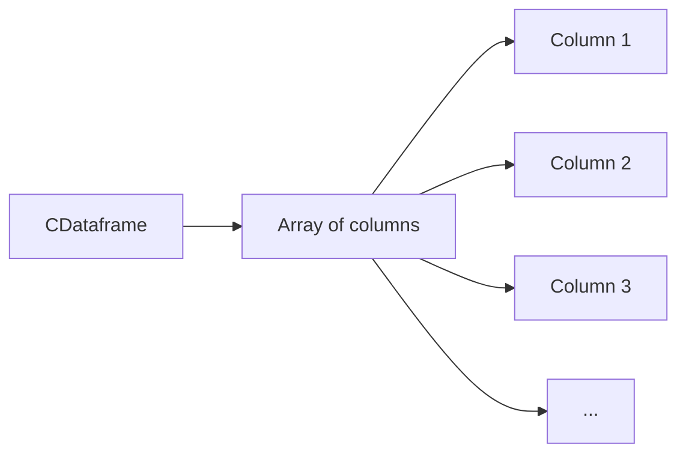
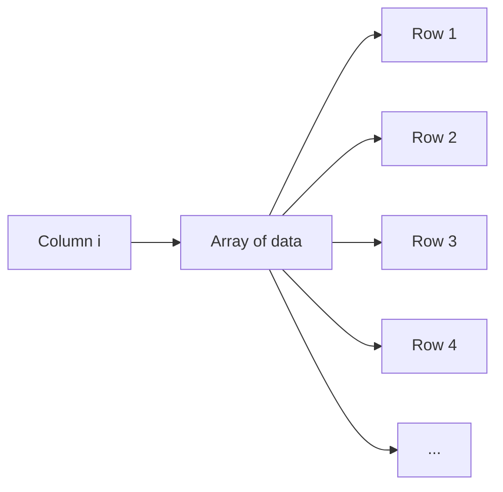

#  CDataframe_tacca_tran
> ###### 2023-L1 EFREI Tacca Timothée, Tran Kim Lan

Spreadsheet programs offer suite of features for managing data, including sorting, graphing, and calculating statistics. However, dealing with large volumes of structured data, can become  repetitive. Performing the same tasks across multiple files manually is time-consuming and prone to errors.

For complex data manipulation, we have to consider using programming languages with powerful libraries like Pandas. Pandas offers a DataFrame data structure, which resembles a spreadsheet and provides flexibility for data analysis. C is language that can control over hardware and memory, making C a less suitable tool to create a CDataframe

You can find out more about our project and our progress by clicking on the link  [Github](https://github.com/timotheetacca/CDataframe_tacca_tran)

## Explanations

Our spreadsheet is called a CDataframe. Each column has a title and can store an indefinite number of data items of the
type int. All the columns must have the same amount of data in order to form a matrix. 

Schematic of a CDataframe :

Our CDataframe can perform the tasks listed below

## 1. Filling
* Creation of an empty CDataframe
* Filling in the CDataframe with user input
* Hard filling of the CDataframe

## 2. Displaying
* Display the entire CDataframe
* Dispalay a part of the CDataframe rows according to a user-provided limit
* Display a part of the columns of the CDataframe according to a limit supplied by the user

## 3. Usual operations
* Add a row of values to the CDataframe
* Delete a row of values from the CDataframe
* Add a column to the CDataframe
* Delete a column from the CDataframe
* Rename the title of a column in the CDataframe
* Check the existence of a value (*search*) in the CDataframe
* Access/replace the value in a CDataframe cell using its row and column number
* Display column names

## 4. Analysis and statistics
* Display the number of rows
* Display the number of columns
* Display the number of cells containing a value greater/less/equal to x (*x given as a parameter*)
  

